# DuoCode — Processo e decisões (Trabalho 2)

Este documento conta como o DuoCode saiu do Trabalho 1 e chegou ao MAF do Trabalho 2: o que mudou, por que escolhemos cada tela, como organizamos o código, o que as telas de detalhe fazem a mais e as dificuldades que tivemos. Todos os prints foram tirados do app rodando no emulador (Android 17, 1080×2400), a partir da versão atual da branch `main`.

**Trio:** André Caires · Gustavo Cáceres · Brenno Soares

Os slides da apresentação estão em [`DuoCode_Documentacao_T2.pdf`](./DuoCode_Documentacao_T2.pdf).

**Sumário**

1. [Como estava no Trabalho 1 e o que mudou](#1-como-estava-no-trabalho-1-e-o-que-mudou)
2. [Por que essas telas novas](#2-por-que-essas-telas-novas)
3. [Decisões de configuração e organização do código](#3-decisões-de-configuração-e-organização-do-código)
4. [A complexidade extra nas telas de Detalhes](#4-a-complexidade-extra-nas-telas-de-detalhes)
5. [Dificuldades e como resolvemos](#5-dificuldades-e-como-resolvemos)
6. [Linha do tempo dos commits](#6-linha-do-tempo-dos-commits)

---

## 1. Como estava no Trabalho 1 e o que mudou

**No Trabalho 1** ([repositório](https://github.com/Gustavo-Caceres/Quiz-App)) entregamos 3 telas estilizadas em Compose: **Boas-vindas** (com "Continuar com GitHub" e "Criar conta com e-mail"), **Trilha** e **Pergunta**. A troca de tela era feita com um `enum class Tela` e um `when` no `MainActivity`, sem Navigation, e os dados eram fixos. No protótipo do Canva também havia as telas de **Resultado** e **Perfil**, que ainda não tinham virado código.

**No Trabalho 2** o app passou a ter 8 telas navegáveis de verdade:

| Tela | Situação | O que mudou |
|---|---|---|
| Boas-vindas | **saiu** | Era uma tela de login/cadastro, e o trabalho não permite login. O app agora abre direto na Trilha. |
| Trilha | evoluiu (T1) | Virou uma aba do BottomNavigation; o nó atual abre o quiz com `navController.navigate(Rotas.PERGUNTA)`. |
| Pergunta (quiz) | evoluiu (T1) | O botão de fechar passou a usar `popBackStack()`; a tela conta os acertos e envia o resultado pela rota. |
| Resultado | nova (vinha do protótipo) | Recebe `acertos` e `total` pela rota e calcula XP e % de acertos. |
| Perfil | nova (vinha do protótipo) | Aba do BottomNavigation com estatísticas e liga semanal. |
| Linguagens | nova | Lista 1: adicionar e remover linguagens. |
| Questões | nova | Lista 2: adicionar e remover questões ligadas a uma linguagem. |
| Detalhe da linguagem | nova | Detalhe da lista 1. |
| Detalhe da questão | nova | Detalhe da lista 2. |

Também entraram na navegação: `NavHost` central, objeto `Rotas`, BottomNavigation com 4 abas e TopAppBar com botão de voltar.

**Fluxo de estudo** (Trilha → Pergunta → Resultado → Trilha):

| Trilha | Pergunta | Resposta escolhida | Resultado |
|---|---|---|---|
| 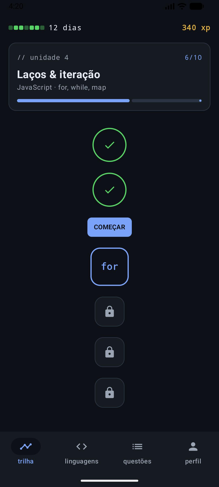 | 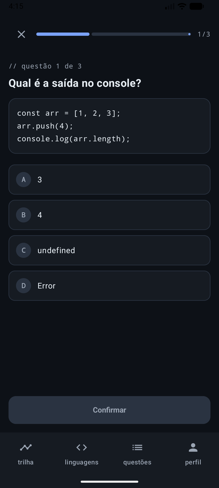 | 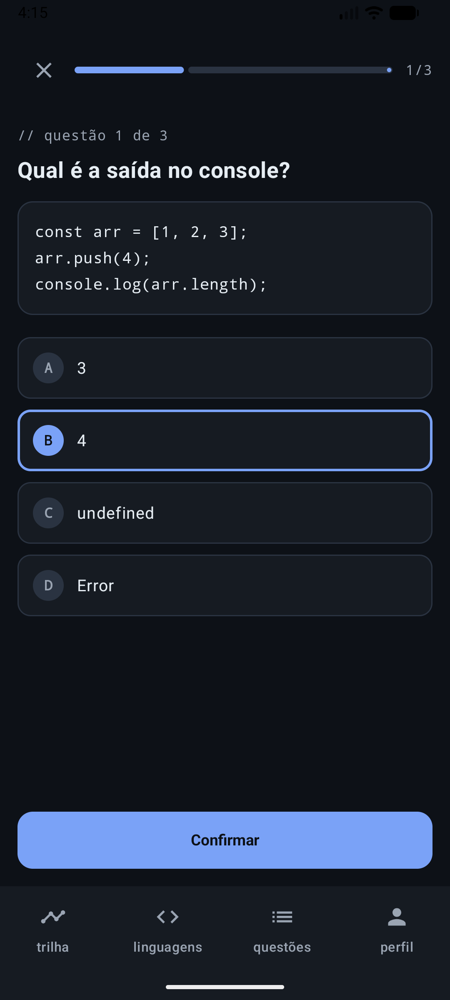 | 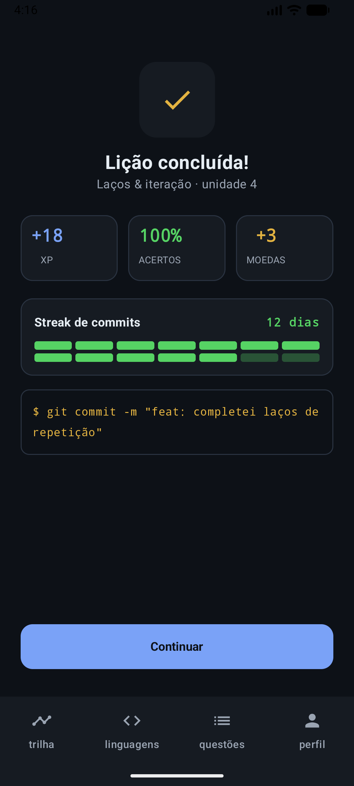 |

O Resultado acima é real: respondemos as 3 perguntas certas, e a tela mostra **100%** de acertos e **+18 XP** (3 acertos × 6), calculados a partir dos números que chegaram pela rota `resultado/{acertos}/{total}`.

---

## 2. Por que essas telas novas

O enunciado pede 2 listas com 2 detalhes. Escolhemos as duas a partir do próprio tema do app: **todo o conteúdo do DuoCode é organizado por linguagem, e toda questão pertence a uma linguagem**. Assim as duas listas se conectam pelo campo `linguagemId`.

| Tela | O que faz | Por que escolhemos |
|---|---|---|
| **Linguagens** | Lista as linguagens, com adicionar e remover | É a forma como o app organiza o conteúdo |
| **Questões** | Banco de perguntas, cada uma ligada a uma linguagem, com dificuldade | As questões são o núcleo de um app de quiz |
| **Detalhe da linguagem** | Progresso, distribuição por dificuldade e as questões daquela linguagem | Deixa visível a ligação entre as duas listas |
| **Detalhe da questão** | Enunciado, resposta, dificuldade, a linguagem dela e marcar como resolvida | Permite conferir e acompanhar cada questão |

**Lista de Linguagens** — adicionar e remover funcionando:

| Lista inicial | Depois de adicionar "TypeScript" | Depois de remover "TypeScript" |
|---|---|---|
| 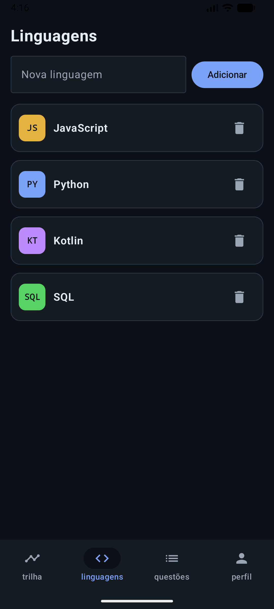 | 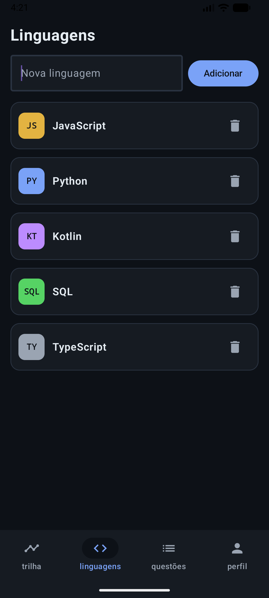 |  |

**Lista de Questões** — formulário com enunciado, resposta, linguagem e dificuldade (dois menus suspensos):

| Lista | Formulário preenchido | Questão nova (#9) no fim da lista |
|---|---|---|
| 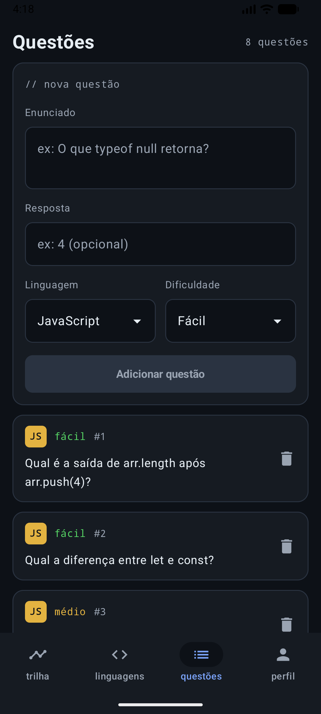 | 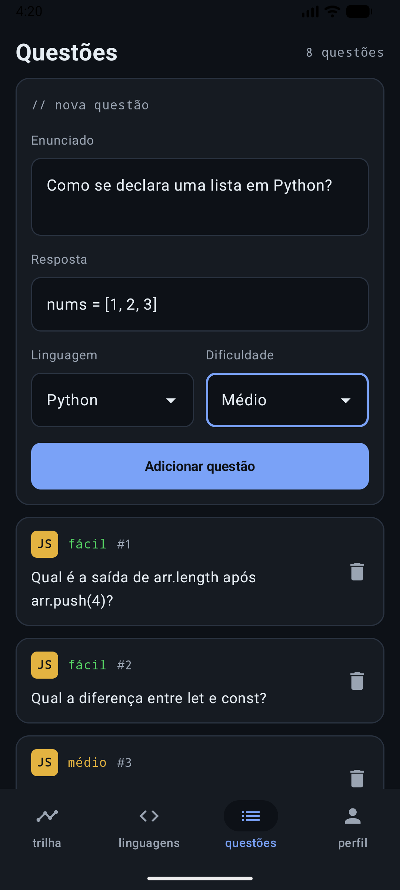 | 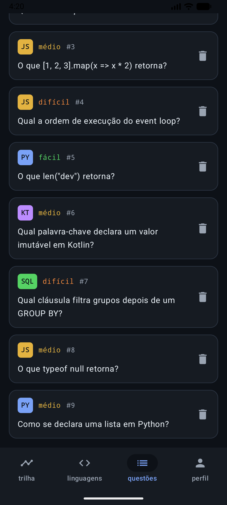 |

A tela de **Perfil** continua com dados fixos, como no protótipo:

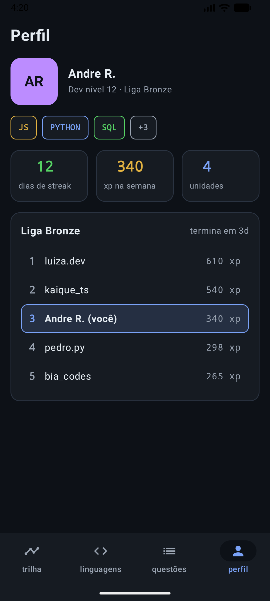

---

## 3. Decisões de configuração e organização do código

```
app/src/main/java/com/example/duocode/
├── MainActivity.kt
├── model/Models.kt              ← data classes Linguagem e Questao + enum Dificuldade
├── navigation/
│   ├── Rotas.kt                 ← todas as rotas como const val
│   └── AppNavigation.kt         ← NavHost, BottomNavigation e as duas listas
└── ui/screens/                  ← uma tela por arquivo
```

**D1 — Objeto `Rotas` com `const val String`.** Todas as rotas ficam num lugar só, o que evita erro de digitação no nome:

```kotlin
object Rotas {
    const val TRILHA = "trilha"
    const val LINGUAGENS = "linguagens"
    const val QUESTOES = "questoes"
    const val PERFIL = "perfil"
    const val DETALHE_LINGUAGEM = "detalhe_linguagem/{id}"
    const val DETALHE_QUESTAO = "detalhe_questao/{id}"
    const val PERGUNTA = "pergunta"
    const val RESULTADO = "resultado/{acertos}/{total}"
}
```

**D2 — Um só `NavHost`, em `AppNavigation.kt`, controlando as 8 telas.** A tela inicial é a Trilha (`startDestination = Rotas.TRILHA`).

**D3 — As duas listas ficam no `AppNavigation`, acima do `NavHost`.** Descartamos criar cada lista dentro da sua tela, porque a lista e o detalhe precisam enxergar os mesmos dados: uma questão criada no Detalhe da linguagem tem que aparecer na aba Questões.

```kotlin
val linguagens = remember { mutableStateListOf(Linguagem(1, "JavaScript", "JS", "Web, front-end e Node"), ...) }
val questoes = remember { mutableStateListOf(Questao(1, "Qual é a saída de arr.length após arr.push(4)?", "4", linguagemId = 1, ...), ...) }
```

**D4 — Passar só o `id` pela rota.** Descartamos passar o objeto inteiro: a rota só leva texto simples. Com o id, o detalhe busca o item certo na lista:

```kotlin
composable(
    route = Rotas.DETALHE_LINGUAGEM,
    arguments = listOf(navArgument("id") { type = NavType.IntType })
) { backStackEntry ->
    val id = backStackEntry.arguments?.getInt("id") ?: -1
    DetalheLinguagemScreen(navController, id, linguagens, questoes)
}
```

**D5 — Duas data classes ligadas pelo `linguagemId`.** Descartamos outros pares, como Lição e Unidade, porque Linguagem e Questão vêm do próprio tema.

```kotlin
data class Linguagem(val id: Int, val nome: String, val sigla: String, val descricao: String = "")

enum class Dificuldade(val rotulo: String) { FACIL("fácil"), MEDIO("médio"), DIFICIL("difícil") }

data class Questao(
    val id: Int,
    val enunciado: String,
    val resposta: String,
    val linguagemId: Int,
    val dificuldade: Dificuldade = Dificuldade.FACIL,
    val resolvida: Boolean = false
)
```

**D6 — Remover uma linguagem apaga as questões dela.** Descartamos deixar questões "órfãs", porque o detalhe da questão não teria linguagem para mostrar.

**D7 — Cada aba do BottomNavigation abre sempre a sua tela principal.** No começo usamos `saveState`/`restoreState` nas abas (o exemplo padrão da documentação), mas isso causou um bug (ver seção 5). A versão final:

```kotlin
navController.navigate(aba.rota) {
    popUpTo(navController.graph.findStartDestination().id)
    launchSingleTop = true
}
```

**D8 — Os dados vivem só na memória** (`mutableStateListOf`), como o enunciado pede. Ao fechar o app, o que foi adicionado se perde; guardar isso é assunto do próximo trabalho.

---

## 4. A complexidade extra nas telas de Detalhes

### Detalhe da linguagem: combina as duas listas e permite editar ali mesmo

Em vez de só reexibir nome e sigla, a tela **calcula tudo a partir das questões daquela linguagem**, filtrando a outra lista pelo `linguagemId`:

```kotlin
// O detalhe combina as duas listas: tudo abaixo é calculado a partir das questões desta linguagem
val questoesDaLinguagem = questoes.filter { it.linguagemId == linguagem.id }
val resolvidas = questoesDaLinguagem.count { it.resolvida }
```

- **Progresso:** "X/Y resolvidas" com barra de progresso (`LinearProgressIndicator`).
- **Distribuição por dificuldade:** uma barra dividida em fácil/médio/difícil, em que cada fatia tem peso proporcional à quantidade de questões.
- **Marcar como resolvida:** o Checkbox troca o item inteiro na lista (`questao.copy(resolvida = ...)`), e o progresso atualiza na hora.
- **Criar questão ali mesmo:** um `AlertDialog` com enunciado, resposta e chips de dificuldade; a questão já nasce ligada à linguagem.
- **Navegação a partir dela:** "ver todas" leva à aba Questões, e "Praticar" abre o quiz.

| Aberto pela lista | Marcando uma questão (2/4 → 3/4) | Criando uma questão | Questão criada: 3/5 e "médio 2" |
|---|---|---|---|
| 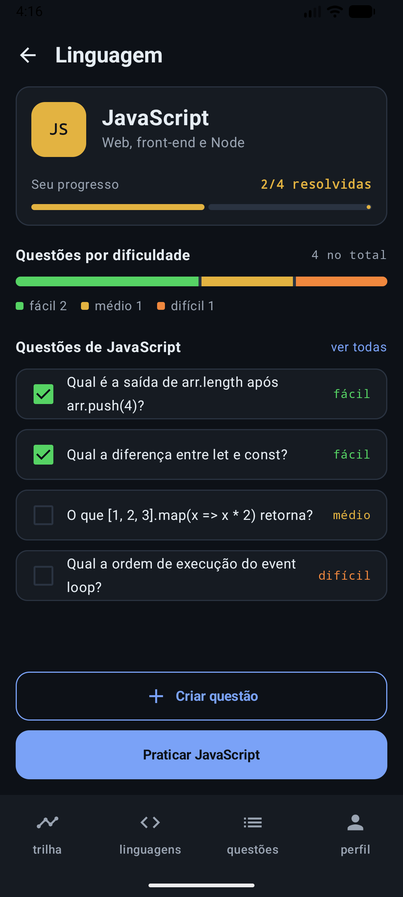 | 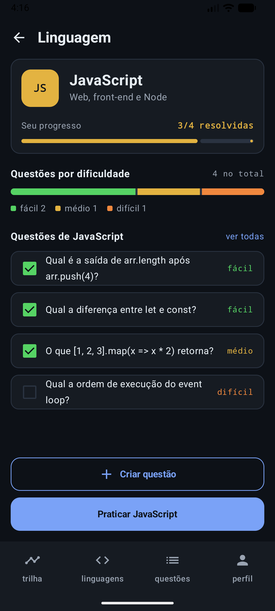 | 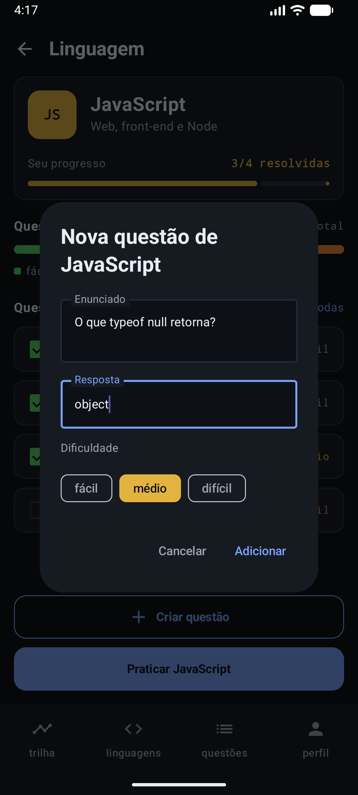 | 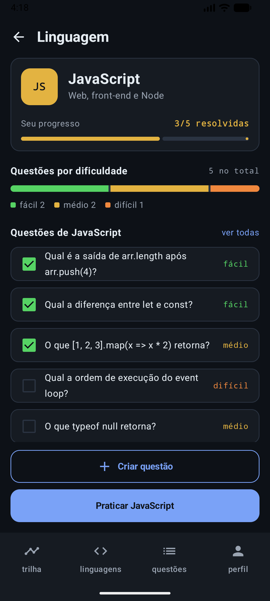 |

**Por que essa:** usa o `linguagemId`, a ligação entre as duas data classes, que é o que dá sentido ao app.

### Detalhe da questão: mostra a linguagem dela e navega de volta para ela

- Busca a questão pelo `id` da rota e a linguagem dela pelo `linguagemId`, mostrando quantas questões aquela linguagem tem.
- Permite marcar a questão como resolvida, e isso aparece no Detalhe da linguagem.
- Tocar no card da linguagem abre o Detalhe da linguagem: os dois detalhes se ligam nos dois sentidos.

| Questão #9, recém-criada | Marcada como resolvida | Tocando em "Python": o detalhe mostra 1/2 |
|---|---|---|
| 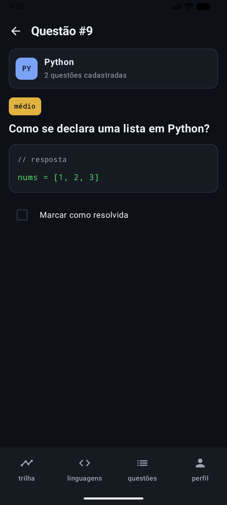 | 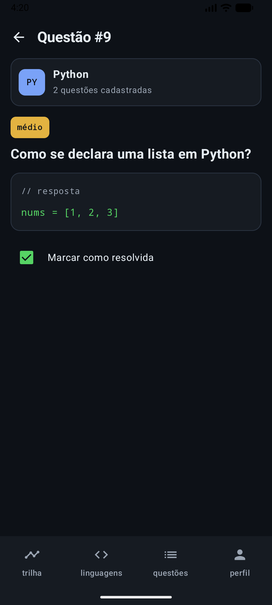 | 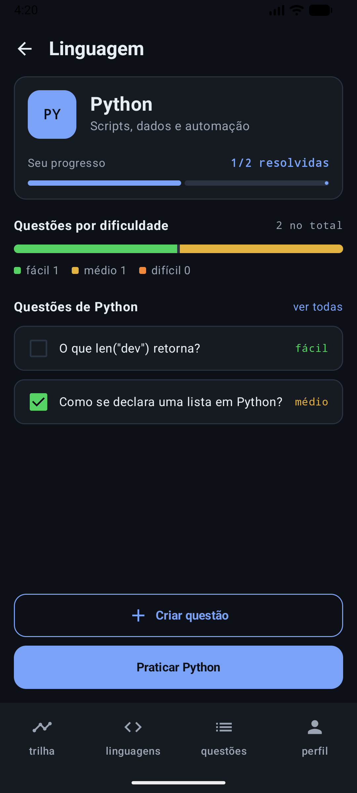 |

---

## 5. Dificuldades e como resolvemos

**André** — *Montar a base que todos usariam e fazer a lista atualizar ao marcar uma questão como resolvida.* Criou a estrutura (`Rotas`, `AppNavigation`, abas) no primeiro commit. Para a lista perceber a mudança, em vez de alterar um campo do item, troca o item inteiro por `questao.copy(resolvida = ...)`.

**Gustavo** — *O Detalhe da linguagem precisava de dados que as data classes não tinham: dificuldade, resolvida e descrição.* Adicionou os campos com valor padrão e o enum `Dificuldade`, sem quebrar as telas que já existiam.

*Depois de juntar todas as telas, a aba "linguagens" às vezes não abria a lista: mostrava o detalhe ou outra aba visitada antes.* A causa era o `saveState`/`restoreState` na barra de navegação, combinado com a tela inicial ser uma das próprias abas: o estado das outras telas ficava salvo em nome dela e era restaurado no lugar da lista. A solução foi tirar o `saveState`/`restoreState` das abas e do "ver todas" (PR #4), e testar vários caminhos entre abas e detalhes.

**Brenno** — *Escolher linguagem e dificuldade num formulário Compose; o protótipo nem tinha campo de resposta.* Criou um `Seletor` genérico com `ExposedDropdownMenuBox`, usado nos dois campos. O campo de resposta entrou depois.

**Como o trio trabalhou:** cada tela foi feita numa branch própria e entrou na `main` por Pull Request (#1 a #4).

---

## 6. Linha do tempo dos commits

| Quando | Quem | Commit | O que entrou |
|---|---|---|---|
| 02/10 14:07 | André | `8423fc6` | Estrutura (Rotas, AppNavigation, abas) + Perfil e Linguagens |
| 05/10 10:06 | Gustavo | `231c725` | Detalhe da linguagem: progresso, dificuldade e criar questão |
| 05/10 10:21 | Gustavo | `b3f4fac` | Merge do PR #1 |
| 05/10 13:24 | Brenno | `3449c87` | Questões: formulário, lista e remoção |
| 05/10 13:26 | Brenno | `41f083a` | Merge do PR #2 |
| 05/10 13:39 | André | `205f158` | Detalhe da questão: linguagem, resposta e resolvida |
| 05/10 13:41 | André | `e7edfd5` | Merge do PR #3 |
| 05/10 13:56 | André | `104dc71` | Trilha, Pergunta e Resultado evoluídas do Trabalho 1 |
| 05/10 13:58 | André | `33a9736` | Merge da branch `telas-trabalho1` |
| 05/10 14:10 | André | `53e0d20` | README e slides da documentação |
| 05/10 14:22 | André | `09234f0` | "Praticar" abre o quiz e o app abre na Trilha |
| 05/10 15:11 | Gustavo | `5137df7` | Abas da barra sempre abrem a tela principal |
| 05/10 15:15 | Gustavo | `c6c493d` | Merge do PR #4 |
